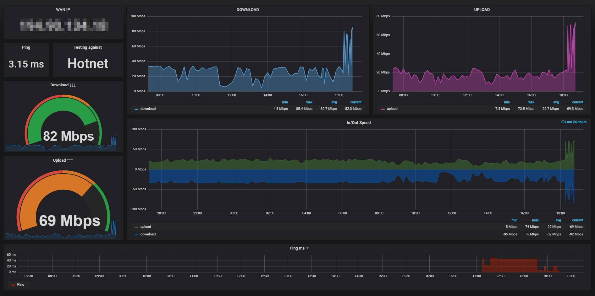
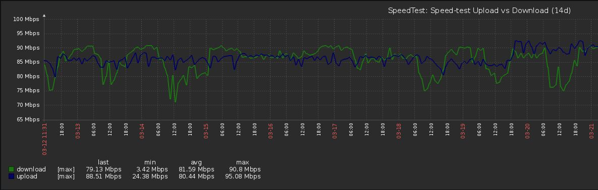

# Speedtest for Zabbix

## a speedtest script based `speedtest` version 2.0.0. that check Download, Upload and WAN-IP and report to Zabbix.


-----


#### TL;DR: 
1. download `spd.sh` and make it execue `(chmod)`.
2. verify `speedtest`installed version is `2.0.0` or higher. (https://github.com/sivel/speedtest-cli)
3. import template `xml` into Zabbix and attache to speed test host.
4. add to `cron sched`

 ```
*/10 * * * * /bin/bash /etc/zabbix/spd.sh
 ```
  ```
@daily find  /tmp/*.log -ctime +1 -exec rm {} \;
``` 



